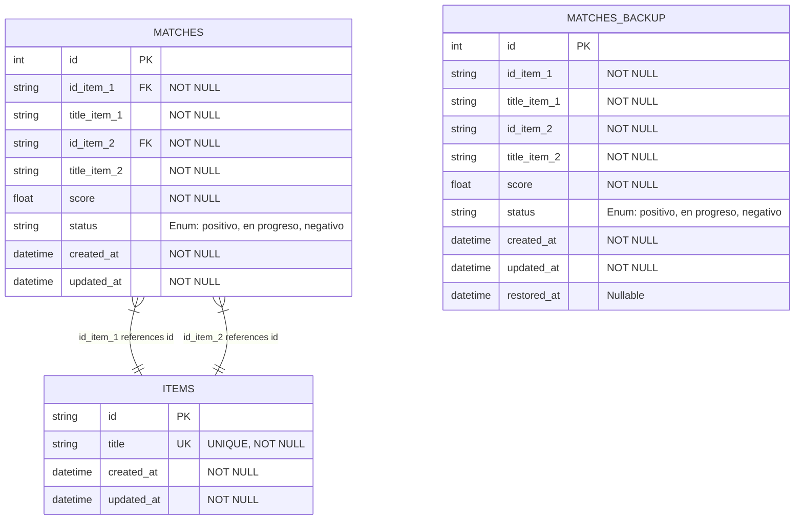

# Diseño de Base de Datos

## Introducción
El diseño de la base de datos tiene como objetivo garantizar la escalabilidad y trazabilidad del sistema, permitiendo gestionar el matching de productos y mantener un histórico de cambios. Se utiliza SQLite como motor de base de datos en modo asíncrono, con SQLAlchemy 2.0 como ORM.

## Diccionario de Datos

### Tabla `items`
| Columna     | Tipo          | Constraints                | Descripción                          |
|-------------|---------------|----------------------------|--------------------------------------|
| id          | String        | PK                         | Identificador único del producto.   |
| id_item     | String        | NOT NULL, FK -> items.id   | Id único del producto.          |
| title       | String        | UNIQUE, NOT NULL           | Título único del producto.          |
| created_at  | DateTime(tz)  | NOT NULL, default now()    | Fecha de creación del registro.     |
| updated_at  | DateTime(tz)  | NOT NULL, default now(), on update now() | Fecha de última actualización. |

### Tabla `matches`
| Columna     | Tipo          | Constraints                | Descripción                          |
|-------------|---------------|----------------------------|--------------------------------------|
| id          | Integer       | PK, autoincrement          | Identificador único del match.       |
| id_item_1   | String        | NOT NULL, FK -> items.id   | ID del primer producto.             |
| title_item_1| String        | NOT NULL                   | Título del primer producto.         |
| id_item_2   | String        | NOT NULL, FK -> items.id   | ID del segundo producto.            |
| title_item_2| String        | NOT NULL                   | Título del segundo producto.        |
| score       | Float         | NOT NULL                   | Puntuación del match.               |
| status      | Enum          | NOT NULL                  | Estado del match: positivo, en progreso, negativo. |
| created_at  | DateTime(tz)  | NOT NULL, default now()    | Fecha de creación del registro.     |
| updated_at  | DateTime(tz)  | NOT NULL, default now(), on update now() | Fecha de última actualización. |

### Tabla `matches_backup`
| Columna     | Tipo          | Constraints                | Descripción                          |
|-------------|---------------|----------------------------|--------------------------------------|
| id          | Integer       | PK, autoincrement          | Identificador único del backup.      |
| id_item_1   | String        | NOT NULL                   | ID del primer producto.             |
| title_item_1| String        | NOT NULL                   | Título del primer producto.         |
| id_item_2   | String        | NOT NULL                   | ID del segundo producto.            |
| title_item_2| String        | NOT NULL                   | Título del segundo producto.        |
| score       | Float         | NOT NULL                   | Puntuación del match.               |
| status      | Enum          | NOT NULL                  | Estado del match: positivo, en progreso, negativo. |
| created_at  | DateTime(tz)  | NOT NULL, default now()    | Fecha de creación del registro.     |
| updated_at  | DateTime(tz)  | NOT NULL, default now(), on update now() | Fecha de última actualización. |
| restored_at | DateTime(tz)  | Nullable                   | Marca el momento del backup/restauración. |

## Diagrama Entidad-Relación (ERD)

